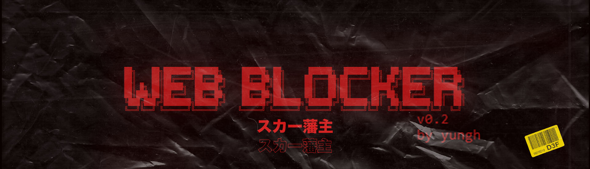

<a href=""></a>
# w3bsite 13locker
`beta build v0.3`
### web blocker | w3b13locker | website blocker | hosts editor

> Block inappropriate websites and ads by their domain

> CommandLine application

> Build with python 3.7

> Beta Build v0.3

[](https://github.com/yunghog/w3bsite13locker)
[](https://github.com/yunghog/w3bsite13locker)
[](https://paypal.me/samartha890?locale.x=en_GB)


## Table of Contents
- [Requirements](#requirements)
- [Installation](#installation)
- [Features](#features)
- [Usage](#usage)
- [ChangeLog](#changelog)
- [Snapshot](#snapshot)
- [Support](#support)

## Requirements
> Python 3.x.x

> git (to clone)

## Installation
### Clone the repository
- clone this repo into any directory using url : https://github.com/yunghog/w3bsite13locker.git
 ```shell
git clone https://github.com/yunghog/w3bsite13locker.git
```
### Setting up
- open a command prompt/terminal with admin rights (*run as administrator) or a python console inside the cloned directory
- run setup.py using command
```shell
python setup.py
```
## Features
- Blocking sites and ads using domains
- Working with hosts file
- Compatible on Windows and Linux machines
- Lightweight python script
- Log file to keep track of hosts
- Easy to handle

## Usage
- To block any domain use command (*without '[' ']' around domain name)
```shell
python main.py -b [domain]
python main.py --block [domain]
```

- To unblock any domain use command (*without '[' ']' around domain name)
```shell
python main.py -ub [domain]
python main.py --unblock [domain]
```
> For full usage refer usage.txt
- `usage.txt`
```
1.setup.py :
# run setup.py with administrator permissions
  --- python setup.py
  * setup.py script will create a backup of hosts file and modify it making it
    suitable for operation

2.main.py :
+----------------+------------------+-------------------------------------+
|  option        |     arguments    |     action                          |
+----------------+------------------+-------------------------------------+
| -b/--block     |   domain name    |   blocking                          |
| -ub/--unblock  |   domain name    |   unblocking                        |
| -l/--list      |   none           |   list already blocked domains      |
| -s/--search    |   domain name    |   find out if the domain is blocked |
| -h/--help      |   none           |   list all possible commands        |
+----------------+------------------+-------------------------------------+

# launch the python console in administrator mode
  --- python main.py -b www.instagram.com
  * this will block instagram website
  --- python main.py -ub www.instagram.com
  * this will unblock instagram website

```

## ChangeLog
`changeLog.txt`
```
-----------UPDATES-----------

# w3b13locker beta v0.1 :
  - blocking, unblocking, listimg and searching domains in hosts file
  - working with 'space' separated host file (i.e, ip address and domains separated by
    single space. Not tabs)
  - configured for windows
  * bugs
    - fails if domain and ip are separated by tab '\t'

# w3b13locker beta v0.2 :
  - setup.py will modify hosts file as required for the operation
  - data/path.txt will hold the os name and hosts file location
  - backup of the orginal hosts file will be automatically created @ data/hostsOriginal.txt
  - configured for windows and linux
  * bugs
    - incompatible with mac os
    - running setup.py after modifying the hosts will overwrite the backup with modified
      version of the hosts file
  * bugs fixed
    - works on linux os
    - hosts file with domains separated by '\t' problem resolved
# w3b13locker beta v0.3 :
  - compatible on mac os
  - working log file @ data/log.ini which holds all logs

```
## Snapshot
### Sample run `main.py`


## Support
- [Buy me a coffee ☕🍪](https://paypal.me/samartha890?locale.x=en_GB)
- [Help me to contribute more !](https://paypal.me/samartha890?locale.x=en_GB)

## Contributing

> To get started...

### Contribute by
  - 🍴 Fork this repo!
  - 👯 Clone this repo to your local machine using `https://github.com/yunghog/w3bsite13locker.git`
  - Pull requests
